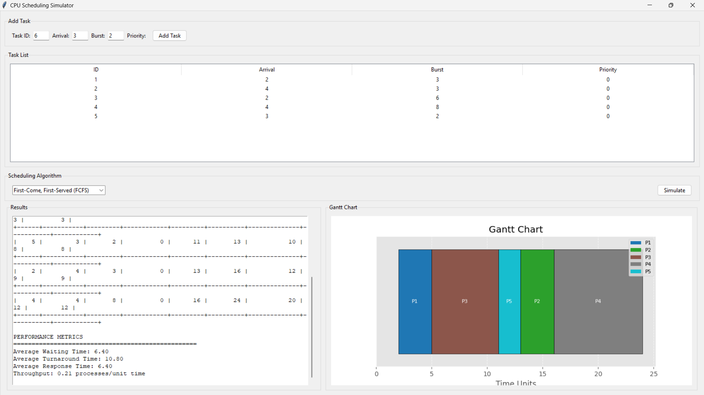

# CPU Scheduling Simulator


A graphical simulator for CPU scheduling algorithms with Gantt chart visualization, built using Python Tkinter and Matplotlib.

 <!-- Add actual screenshot -->

## Features
- Supports 6 scheduling algorithms:
  - FCFS (First-Come, First-Served)
  - SJF (Shortest Job First)
  - Priority Scheduling (Preemptive & Non-Preemptive)
  - Round Robin (RR)
  - SRTF (Shortest Remaining Time First)
- Interactive GUI for task input
- Real-time Gantt chart visualization
- Performance metrics calculation:
  - Average Waiting Time
  - Average Turnaround Time
  - Throughput
- Exportable results in tabular format

## Installation
### Prerequisites
- Python 3.8+
- Tkinter (usually included with Python)
- Matplotlib
- NumPy
- Tabulate

```bash
# Install dependencies
pip install -r requirements.txt
